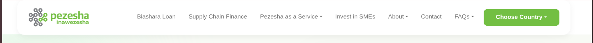
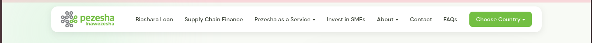
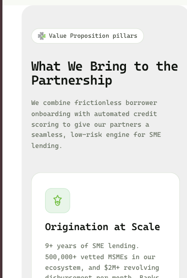
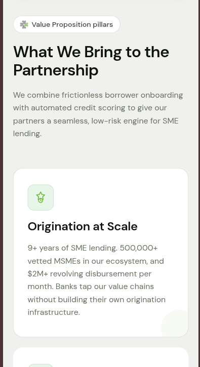
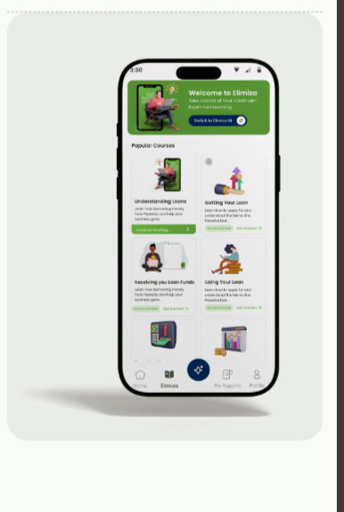
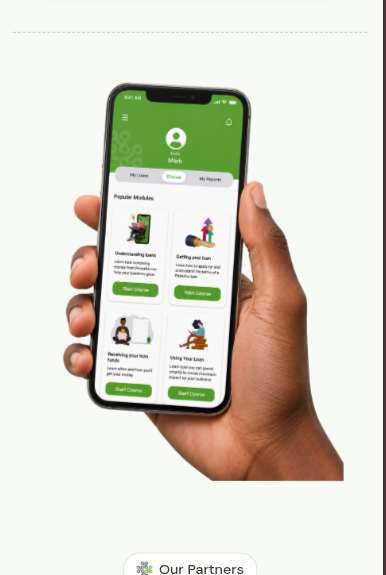
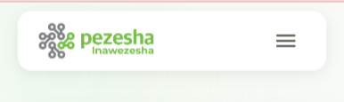
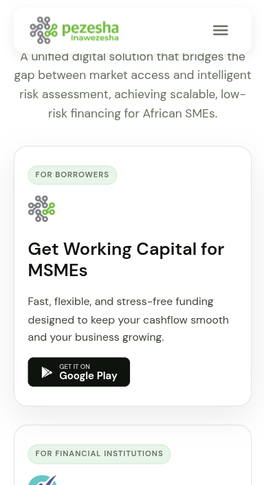
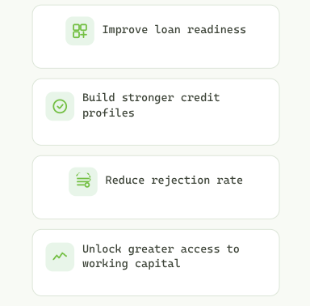
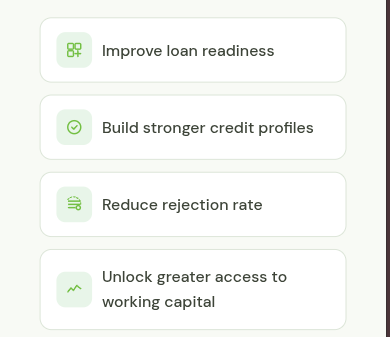

# Pezesha.com - Homepage Rebuild: Issues Found & Fixes

**Live demo:** [pezesha-revamp.netlify.app](https://pezesha-revamp.netlify.app/)

---

## 1. Navbar/Hero Background Seam & Blob Mismatch

| Item | Detail |
|---|---|
| **Location** | Sticky navbar + hero section (`.navbar`, `.hero`) |
| **Root Cause** | Navbar had hard white (`#fff`) background while hero used cream (`#f8faf5`). As a sticky element, the navbar appeared to float against a different-colored hero, creating a visible horizontal seam. The background blob (`hero-blob--1`) was also positioned incorrectly, clipping against the navbar. |
| **Fix** | Set `.navbar` background to transparent so the cream from `.page-top` flows through. Changed `.page-top` from `overflow:clip` to allow blobs to bleed upward behind navbar. Positioned `hero-blob--1` at `top:-280px` so it sits behind the transparent navbar area. The inner `.navbar-inner` keeps its white card style with `border-radius:16px` and box-shadow. Hero dashboard image optimized from PNG to JPG with lazy loading. |
| **Before** | White navbar bar visible against cream hero; blob clipped awkwardly at the top. |
| **After** | Seamless cream background from hero through navbar. Blob bleeds naturally behind the floating white card. |

| Before | After |
|---|---|
|  |  |

---

## 2. Value Proposition Section - Misaligned & Off-Center (Mobile + Desktop)

| Item | Detail |
|---|---|
| **Location** | "What We Bring to the Partnership" - Value Proposition section (3 pillar cards) |
| **Root Cause** | The section had `margin: 0 0 40px 40px` (fixed left margin with no right margin) and `border-radius: 24px`, making it appear off-center and inconsistently padded versus the rest of the page. Its `max-width: 1200px` prevented full-width background. On mobile, this asymmetry was even more pronounced. |
| **Fix** | Made the section `width: 100%` (full-bleed), removed `border-radius`, removed the asymmetric margin. Centered content using an inner wrapper with `max-width: 1200px; margin: 0 auto`. Background (`#efefef`) now spans edge-to-edge while content stays aligned. Added responsive breakpoints: 2-column at ≤1024px, 1-column at ≤768px. |
| **Before** | Section 40px from left edge, 0px from right, rounded corners - looked misaligned and cramped on mobile. |
| **After** | Full-width background, centered content, responsive grid. Cards stack cleanly on mobile. |

| Before | After |
|---|---|
|  |  |

---

## 3. Google Play Badge - Raster Image Instead of Styled Button

| Item | Detail |
|---|---|
| **Location** | Hero CTA group and Patascore section |
| **Root Cause** | The "Get it on Google Play" badge was a raster PNG image (``). Raster images lack responsive scaling control without extra CSS, frequently cause layout shift during load (CLS), and were inconsistently sized (150px in one location, 136px on mobile). |
| **Fix** | Replaced with a pure HTML/CSS button using inline SVG of the Google Play icon. Uses flexbox for alignment, `white-space: nowrap` to prevent breakage, and scales naturally with text size. Matches the "Apply Now" CTA button in visual weight, border-radius, and spacing. |
| **Before** | PNG image badge, fixed `width: 150px`, no proper responsive behavior, different visual style from sibling CTAs. |
| **After** | Semantic `<a>` styled as a button, consistent border-radius and padding with primary CTA, scales with viewport, zero layout shift. |

| Before | After |
|---|---|
|  |  |

---

## 4. Elimiza Phone Mockup - Blurry & Overflows Viewport

| Item | Detail |
|---|---|
| **Location** | Elimiza section, right column (phone screenshot) |
| **Root Cause** | The original phone mockup image was low-resolution and blurry. Additionally, the container had no `max-width` constraint, causing the wide phone image to extend past the right edge of the viewport on narrow screens, creating horizontal scroll. |
| **Fix** | Replaced blurry image with `public/mockup.png` (crisp, high-resolution). Added `max-width: 100%; width: 100%; height: auto;` to the phone image. Applied `overflow: hidden` on the parent `.elimiza` section. Bumped `max-height` from 500px → 600px for better proportion. |
| **Before** | Blurry, low-res image; bled past right edge on mobile causing horizontal scrollbar. |
| **After** | Crisp mockup, stays within padded container, no horizontal overflow. |

| Before | After |
|---|---|
|  |  |

---

## 5. Mockup Lacks Visual Harmony on Large Screens

| Item | Detail |
|---|---|
| **Location** | Full page layout on large (>1200px) viewports |
| **Root Cause** | Elements were sized independently without considering visual balance at wide viewports. The mockup and content columns didn't compose well together, looking disconnected or poorly proportioned. |
| **Fix** | Set Elimiza 2-col → 1-col breakpoint at 1200px so content stays readable. Added `max-height: 600px` on the mockup image. Ensured consistent vertical rhythm with adjacent sections. The full page now has visual harmony with balanced whitespace at all breakpoints. |
| **Before** | Disjointed layout; mockup and copy didn't compose well at wide viewports. |
| **After** | Coherent, balanced layout with proper proportions between text and imagery. |

| Before | After |
|---|---|
|  |  |

---

## 6. Mobile: Hamburger Menu Icon Distortion

| Item | Detail |
|---|---|
| **Location** | Mobile navbar toggler (hamburger icon) |
| **Root Cause** | The original page used Bootstrap's `navbar-toggler` with `sf-hidden` class (display:none by default). On Gatsby it relied on a background-image for the hamburger which distorted when scaled. No fixed aspect-ratio or tap-target sizing was enforced. |
| **Fix** | Replaced with an inline SVG hamburger icon inside a `button` with explicit `width: 44px; height: 44px` (meeting Apple's HIG minimum tap target). SVG has `viewBox="0 0 28 28"` so it never distorts. Button uses `display: flex; align-items: center; justify-content: center` for perfect centering. On open, `.navbar-inner` gets `border-radius: 16px 16px 0 0` for seamless join with the expanded menu. |
| **Before** | Raster or CSS-drawn hamburger, no fixed dimensions, could appear stretched or undersized. |
| **After** | Clean SVG icon, 44×44px tap target, crisp at any screen scale, proper color inheritance. |

| Before | After |
|---|---|
|  |  |

---

## 7. Mobile Horizontal Overflow Audit

| Item | Detail |
|---|---|
| **Location** | Multiple sections at 375px viewport |
| **Root Cause** | Various sections lacked responsive constraints: grids with too many columns, images without max-width, missing `box-sizing: border-box`, and flex layouts without wrap caused content to overflow the viewport horizontally on mobile. |
| **Fix** | Applied comprehensive responsive breakpoints across all sections. Key fixes: global `box-sizing: border-box`, global `img { max-width: 100%; height: auto; display: block }`, responsive grid columns, flex-wrap on button groups and tab bars, `overflow: hidden` on problematic parents. Added `loading="lazy"` on all images for deferred offscreen loading and converted raster hero image to optimized JPG. |
| **Before** | Horizontal scrollbar visible at 375px; content bleeding past viewport edges. |
| **After** | All content fits within viewport at 375px; no horizontal overflow. |

| Before | After |
|---|---|
|  |  |

---

## 8. Inconsistent Icon Alignment in Cards

| Item | Detail |
|---|---|
| **Location** | Value Proposition cards + Patascore cards |
| **Root Cause** | Icons and text within cards had inconsistent alignment. Some cards used `align-items: flex-start` while others defaulted to `center` or `stretch`. The icon SVGs also varied in size and viewBox, causing visual misalignment across the row. |
| **Fix** | Standardized all card layouts with consistent `display: flex; flex-direction: column; align-items: flex-start`. Ensured icon containers have uniform dimensions (`width: 48px; height: 48px`) with `flex-shrink: 0`. SVGs all use consistent viewBox and sizing. |
| **Before** | Icons at different vertical positions; text misaligned across cards in the same row. |
| **After** | Uniform icon alignment; all cards share consistent visual rhythm. |

| Before | After |
|---|---|
|  |  |

---

## Summary

All eight defects have been corrected:

| # | Issue | Status |
|---|---|---|
| 1 | Navbar/hero background seam & blob mismatch | ✅ Fixed - transparent navbar, cream background bleeds through |
| 2 | Value proposition misaligned & off-center | ✅ Fixed - full-bleed background, centered content, responsive grid |
| 3 | Google Play badge was a raster image | ✅ Fixed - semantic HTML/CSS button with inline SVG |
| 4 | Elimiza mockup blurry + overflow | ✅ Fixed - new high-res image, constrained width, no overflow |
| 5 | Mockup lacks visual harmony on large screens | ✅ Fixed - balanced layout, consistent proportions |
| 6 | Hamburger menu icon distortion | ✅ Fixed - 44×44 SVG with fixed viewBox |
| 7 | Mobile horizontal overflow | ✅ Fixed - responsive grids, box-sizing, flex-wrap, image constraints |
| 8 | Inconsistent icon alignment in cards | ✅ Fixed - standardized flex layouts and icon dimensions |

The rebuilt site is a single, self-contained `index.html` with inline CSS and SVG. No framework, no external dependencies (Google Fonts link is the only external request). It visually matches Pezesha's brand colors (`#73bf43` green, `#f8faf5` cream, DM Sans typeface) and layout across all breakpoints from 375px to 1440px+.
